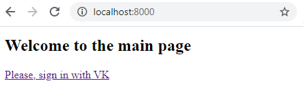
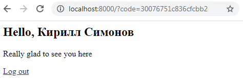

## Web-2020-Lab-2

### Requirements
- Python 3
- Django <br>
```python -m pip install Django```

### How to start
- Download code
- In the curent folder run the command: <br>
  ```python manage.py runserver```
  
 ### Example of work
  
 
